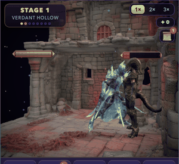
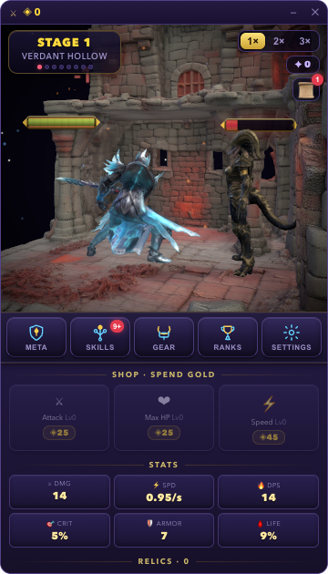
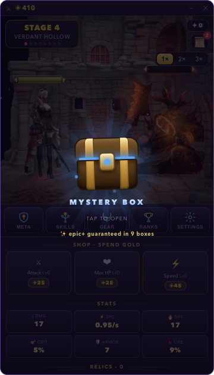
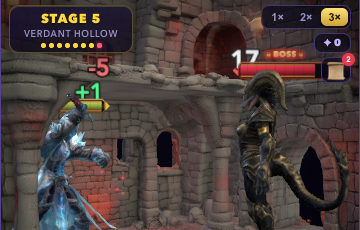
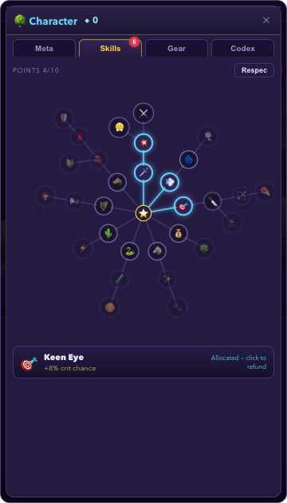
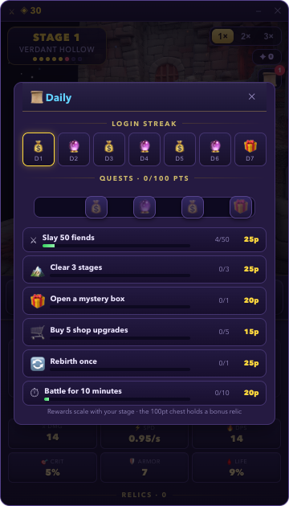
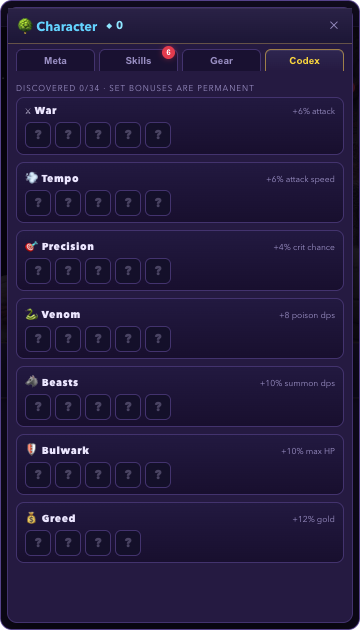

<div align="center">


# ⚔️ AFK Arena

**A roguelite idle battler that lives in your macOS menu bar.**

Your hero fights, loots and grows — whether you're watching or not.
Close the window and the dragon keeps grinding from the menu bar. 🐉

[](https://github.com/serdargavas/afk-arena/releases/latest)




</div>

---

## 📥 Download

**[⬇ Grab the latest .dmg from Releases](https://github.com/serdargavas/afk-arena/releases/latest)** — open it, drag the dragon into Applications, play.

> First launch on macOS: right-click the app → **Open** (the build is not notarized).

---

## ✨ What makes it fun

|  |  |
|---|---|
| **Real-time 3D battles** | Fully animated 3D hero & monsters fight in a WebGL arena — combos, crits, misses, damage numbers, screen shake. Watch at 1×, 2× or 3×. |
| **Mystery Boxes** | Every 3rd stage drops a chest that rattles and glows with the rarity you're about to reveal. Every 10th box is a **guaranteed epic+** — the pity counter is right there on the box. |
| **True idle** | Close the window: the game tucks itself into the **menu bar** and keeps farming. Come back to an Idle Loot chest bursting with gold. You can never die while away. |
| **PoE-style skill tree** | 30 passives across 9 branches radiating from your class. Chains grow from the centre, refunds are free. |
| **Relic Codex** | 34 relics to collect across 5 rarities. Complete an archetype and its set bonus becomes **permanent across every run**. |
| **Daily habit loop** | Point-based daily quests (pick your own path to 100), milestone chests, and a forgiving 7-day login calendar that never punishes a missed day. |
| **Rebirth meta** | Push stages, die, bank essence, buy permanent upgrades, equip the gear your fallen runs left behind — then go further. |
| **Leaderboard** | Sign in with Google and race your best stage against everyone else. |

---

## 📸 Screenshots

| Combat | Mystery Box | Boss fights |
|---|---|---|
|  |  |  |

| Skill tree | Daily quests | Relic codex |
|---|---|---|
|  |  |  |

🎬 Prefer motion? [Watch a 30-second gameplay clip](docs/media/gameplay.webm).

---

## 🛠 Built with

- **[Tauri 2](https://tauri.app)** — native macOS app (no Electron), menu-bar tray, Google OAuth in Rust
- **[React 19](https://react.dev) + [react-three-fiber](https://docs.pmnd.rs/react-three-fiber)** — the entire arena is a three.js scene
- **Deterministic simulation** — fixed-timestep combat that replays identically online, offline and in tests (36 unit tests)
- **[Supabase](https://supabase.com)** — global leaderboard

## 🔧 Build from source

```bash
git clone https://github.com/serdargavas/afk-arena.git
cd afk-arena
pnpm install
pnpm tauri dev      # run
pnpm tauri build    # produce .app + .dmg
```

Requires Node 20+, pnpm and the Rust toolchain.

---

<div align="center">
<sub>Made for fun. The dragon in your menu bar never sleeps. 🐉</sub>
</div>
